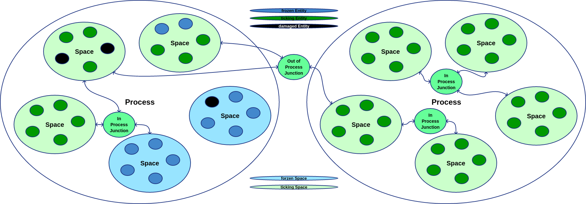

# Basics
## Actor Model
The actor model first came up in 1973 by Carl Hewitt as a computation model inspired by physics and biology.
The theory behind flow wasn't influenced by the actor model since it was unknown at the time of design.
Nonetheless it is overlapping and therefore the correct classification for that aspect of flow.

[Actor model@Wikipedia](https://en.wikipedia.org/wiki/Actor_model)

### Entity
Equals to actor model's actor.
It receives signals which are triggering some functionality.
Also it can send signals to other entities.

#### Aspect
An entity has aspects which are information combined with adequate function for beein an... aspect of the entity. 

### Signal
Is data which is getting exchanged between entities.

Flow knows three types of signals
#### Unicast
Is a directed signal from entity A to entity B

#### Anycast
Is a request directed to all entities within one or more spaces receptive to that certain kind of anycast. However this request can be accepted by only one entity. Anycasts cannot pass non confirming junctions.

#### Multicast
Is a cast directed to all entities within one or more spaces receptive to that certain kind of multicast. All possible and reachable destination entities are receiving multicasts.

### Space
Offers n entities a media where signals can be exchanged and functionality can be processed.

### Junction
Allows signals to transparently cross borders.
This way multiple spaces can be interconnected.

Junctions like entities have levels. The junction has to have a lower or equal level to reach an entity.

### Process
Hosts m spaces. While a real OS process could in theory host multiple flow processes it is adviced to map 1:1.

## Structure of causality
While the actor model is a quite powerful way to compute, the real power of flow lies in its theory of causality.
It allows well defined causal chains to run through different entities across all integrated spaces.
The designer is enabled to break down complex causality into single sequential chains and therefore create complex software without needing to overview its complexity as whole.

Lets forget everything, empty your mind. So we can start with a few definitions.

### Definition of information
Is the order of what there is. Information can be continuous (analog) or discrete.

### Definition of data
Is a discrete picture of information.
Continuous information cannot get completely pictured and therefor not beeing restored.
Discrete information can be restored from a complete set of data.

Since flow is a runtime for digital computing, information within is discrete.
So there is an equality between data and information.

### Definition of functionality
Is change of Information.
Discrete functionality can be change of continuous or discrete Information.
Continuous functionality can only be change of continuous Information.
However continuous functionality can hit a threshold which then triggers a discrete functionality.

### Definition of tick
Is a well defined difference in information.
Ticks are always discrete while contained functionality could be continuous.

### Definition of causal chain
Is a set of consecutive discrete ticks on data/signals or 1 continuous functionality which can be sliced into a sequence of ticks.

In theory (not in flow) you can slice continuous functionality into an infinite amount of ticks.

### Definition of causality
Is an integral set of causal chains.

